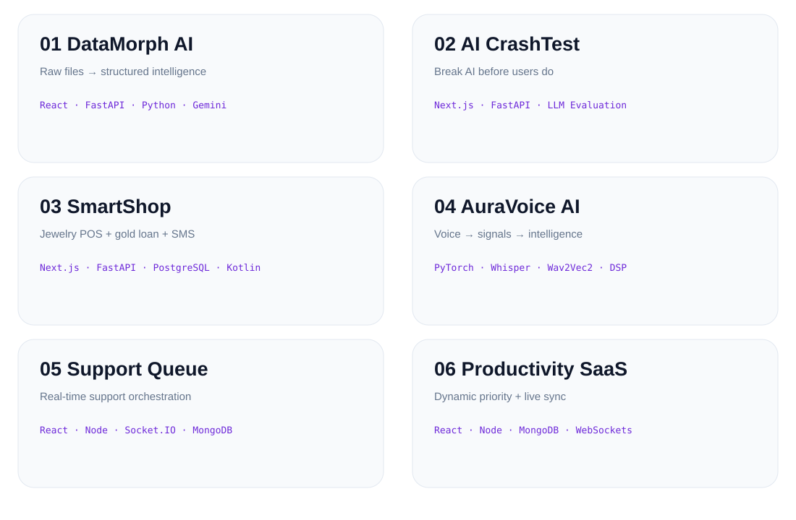

<picture>
  <source media="(prefers-color-scheme: dark)" srcset="./assets/hero-dark.svg">
  
</picture>

 

  

<picture>
  <source media="(prefers-color-scheme: dark)" srcset="https://readme-typing-svg.demolab.com?font=JetBrains+Mono&size=19&duration=2800&pause=900&color=22D3EE&center=true&vCenter=true&width=720&lines=AI+Engineer+%7C+Full+Stack+Builder;Building+AI+Agents+%26+Automation;Turning+ideas+into+working+products">
  
</picture>

---

### ⚡ AI · SOFTWARE · AUTOMATION

`AI / ML` · `FULL STACK` · `REAL-TIME` · `DATA`

## 🚀 Top 6 Builds

<picture>
  <source media="(prefers-color-scheme: dark)" srcset="./assets/projects-dark.svg">
  
</picture>

[**01 DataMorph AI**](https://github.com/vitesh9876/DataMorph-AI) ·
[**02 AI CrashTest**](https://github.com/vitesh9876/ai-crashtest) ·
[**03 SmartShop**](https://github.com/vitesh9876/billing-app)

 

[**04 AuraVoice AI**](https://github.com/vitesh9876/auravoice-ai) ·
[**05 Support Queue**](https://github.com/vitesh9876/Intelligent-Support-Queue-System) ·
[**06 Productivity SaaS**](https://github.com/vitesh9876/Real-Time-Productivity-Management-System-Mini-SaaS-)

---

## 🧰 Stack

---

## 📈 GitHub Pulse

<picture>
  <source media="(prefers-color-scheme: dark)" srcset="https://github-readme-stats.vercel.app/api?username=vitesh9876&show_icons=true&hide_border=true&rank_icon=github&theme=github_dark">
  
</picture>

<picture>
  <source media="(prefers-color-scheme: dark)" srcset="https://github-readme-stats.vercel.app/api/top-langs/?username=vitesh9876&layout=compact&hide_border=true&theme=github_dark">
  
</picture>

 

<picture>
  <source media="(prefers-color-scheme: dark)" srcset="https://streak-stats.demolab.com?user=vitesh9876&theme=dark&hide_border=true">
  
</picture>

 

<picture>
  <source media="(prefers-color-scheme: dark)" srcset="https://github-readme-activity-graph.vercel.app/graph?username=vitesh9876&bg_color=0D1117&color=22D3EE&line=A78BFA&point=34D399&area=true&hide_border=true">
  
</picture>

---

<picture>
  <source media="(prefers-color-scheme: dark)" srcset="https://readme-typing-svg.demolab.com?font=JetBrains+Mono&size=17&duration=2200&pause=800&color=22D3EE&center=true&vCenter=true&width=620&lines=BUILD+%E2%86%92+BREAK+%E2%86%92+LEARN+%E2%86%92+REBUILD;KEEP+BUILDING.;KEEP+SHIPPING.">
  
</picture>

  

<picture>
  <source media="(prefers-color-scheme: dark)" srcset="./assets/footer-dark.svg">
  
</picture>

